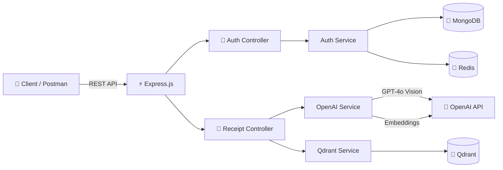

# 🧾 Smart Receipt AI

An intelligent receipt management backend that uses **GPT-4o Vision** to analyze receipt images, **Qdrant** vector database for semantic search, and **MongoDB** for user management.

## Architecture



## Tech Stack

| Technology | Purpose |
|---|---|
| **Node.js + Express 5** | REST API server |
| **OpenAI GPT-4o** | Receipt image analysis & category classification |
| **OpenAI Embeddings** | Text-to-vector for semantic search |
| **Qdrant** | Vector database for receipt storage & similarity search |
| **MongoDB** | User accounts & authentication |
| **Redis** | JWT token blacklisting (logout) |
| **Docker Compose** | Container orchestration |

## Features

- 📸 **Upload & Analyze** — Upload receipt images, GPT-4o extracts structured data (store, items, total, date, payment method)
- 🏷️ **Auto-Categorization** — AI classifies receipts into: `shopping`, `food`, `transportation`, `utilities`, `healthcare`, `entertainment`, `other`
- 🔍 **Semantic Search** — Search receipts by natural language queries using vector similarity
- 🔎 **Category Filter** — Filter receipts by category on list and search endpoints
- 🔐 **JWT Authentication** — Register, login, logout with token blacklisting via Redis
- 👤 **User-scoped Data** — Each user only sees their own receipts

## Project Structure

```
src/
├── app.js                    # Express app & server startup
├── config/
│   ├── db.js                 # Qdrant client setup
│   ├── env.js                # Environment variable singleton
│   ├── mongodb.js            # MongoDB connection
│   └── redis.js              # Redis client
├── controllers/
│   ├── authController.js     # Auth HTTP handlers
│   └── receiptController.js  # Receipt HTTP handlers
├── middleware/
│   └── auth.js               # JWT verification middleware
├── models/
│   └── User.js               # Mongoose user schema
├── routes/
│   ├── authRoutes.js         # Auth route definitions
│   └── receiptRoutes.js      # Receipt route definitions
├── services/
│   ├── authService.js        # Registration, login, JWT logic
│   ├── openaiService.js      # GPT-4o Vision & embeddings
│   ├── qdrantService.js      # Vector DB operations
│   └── redisService.js       # Token blacklist operations
└── utils/
    └── fileHelper.js         # File I/O utilities
```

## Getting Started

### Prerequisites

- [Docker](https://www.docker.com/) & Docker Compose
- [OpenAI API Key](https://platform.openai.com/api-keys)

### Setup

1. **Clone the repo**
   ```bash
   git clone https://github.com/your-username/FaturaAi.git
   cd FaturaAi
   ```

2. **Create `.env` file** (copy from example)
   ```bash
   cp .env.example .env
   ```

3. **Add your OpenAI API key** to `.env`
   ```env
   OPENAI_API_KEY=sk-your-key-here
   JWT_SECRET=your-random-secret-key
   ```

4. **Start all services**
   ```bash
   docker-compose up --build -d
   ```

5. **Verify**
   ```
   GET http://localhost:3000/health
   ```

### Ports

| Service | Port |
|---|---|
| Express API | `3000` |
| Qdrant | `6333` |
| MongoDB | `27022` |
| Redis | `6379` |

## API Reference

### Auth

| Method | Endpoint | Description | Auth |
|---|---|---|---|
| `POST` | `/api/auth/register` | Create account | ❌ |
| `POST` | `/api/auth/login` | Login & get JWT | ❌ |
| `POST` | `/api/auth/logout` | Blacklist token | ✅ |
| `GET` | `/api/auth/me` | Get profile | ✅ |

#### Register
```json
POST /api/auth/register
{
    "name": "Fatih",
    "email": "fatih@example.com",
    "password": "123456"
}
```

#### Login
```json
POST /api/auth/login
{
    "email": "fatih@example.com",
    "password": "123456"
}
```

---

### Receipts

> All receipt endpoints require `Authorization: Bearer <token>` header.

| Method | Endpoint | Description |
|---|---|---|
| `POST` | `/api/receipts/upload` | Upload & analyze receipt image |
| `GET` | `/api/receipts` | List all my receipts |
| `GET` | `/api/receipts?category=shopping` | List receipts by category |
| `POST` | `/api/receipts/search` | Semantic search receipts |

#### Upload Receipt
```
POST /api/receipts/upload
Content-Type: multipart/form-data

Key: receipt  →  [select image file]
```

**Response:**
```json
{
    "message": "Receipt processed successfully.",
    "id": "uuid",
    "data": {
        "storeName": "Migros",
        "date": "2026-02-19",
        "items": [{ "name": "Süt", "quantity": 2, "price": 45.90 }],
        "total": 161.65,
        "category": "shopping"
    }
}
```

#### List Receipts (with optional category filter)
```
GET /api/receipts
GET /api/receipts?category=food
GET /api/receipts?limit=10
```

#### Search Receipts
```json
POST /api/receipts/search
{
    "query": "market alışveriş",
    "category": "shopping",
    "limit": 5
}
```

### Available Categories

| Category | Description |
|---|---|
| `shopping` | Grocery stores, markets, retail |
| `food` | Restaurants, cafes, fast food |
| `transportation` | Bus, taxi, fuel, transit cards |
| `utilities` | Phone, internet, electricity bills |
| `healthcare` | Pharmacy, hospital, medical |
| `entertainment` | Cinema, concerts, events |
| `other` | Anything that doesn't fit above |

## Environment Variables

| Variable | Required | Default | Description |
|---|---|---|---|
| `PORT` | No | `3000` | Server port |
| `OPENAI_API_KEY` | **Yes** | — | OpenAI API key |
| `QDRANT_URL` | No | `http://localhost:6333` | Qdrant connection URL |
| `QDRANT_COLLECTION_NAME` | No | `receipts` | Qdrant collection name |
| `MONGODB_URI` | No | `mongodb://localhost:27017/faturaai` | MongoDB connection string |
| `REDIS_URL` | No | `redis://localhost:6379` | Redis connection URL |
| `JWT_SECRET` | **Yes** | — | Secret key for JWT signing |
| `JWT_EXPIRES_IN` | No | `7d` | JWT expiration time |

## License

ISC
